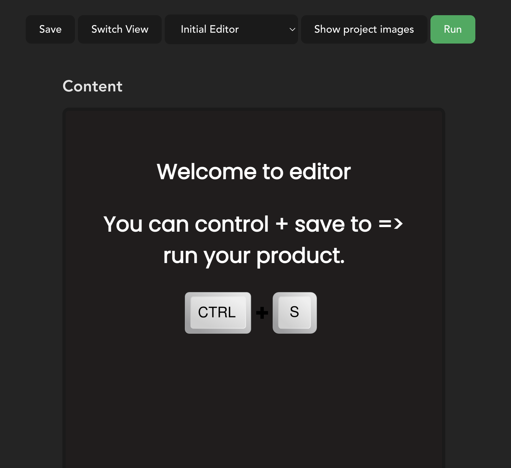
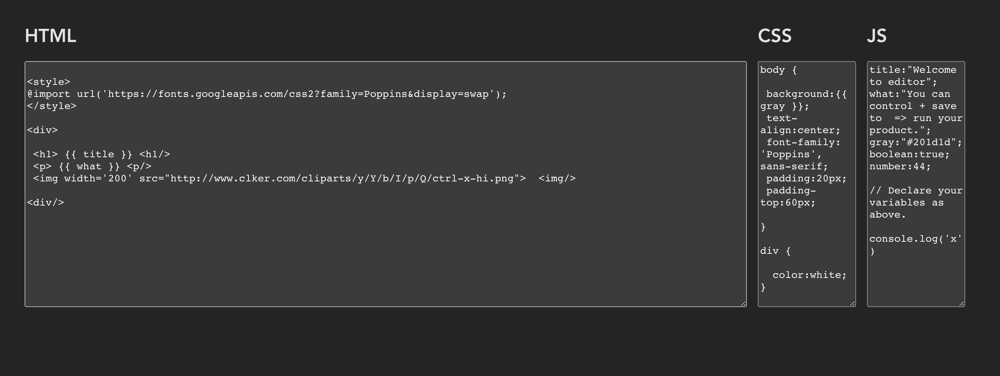

# Easy HTML CSS JS Editor

This project is a basic code editor written in vanilla javascript.


## Screenshots





## Demo

Demo:


## Installation

Install my-project with npm 

```bash
  git clone https://github.com/rokasta12/easy-HTML-CSS-JS-Editor.git
  npm install
  npm run dev
```

if you dont have pnpm installed

```bash
    npm i pnpm -g
```
install with pnpm
```bash
  git clone https://github.com/rokasta12/easy-HTML-CSS-JS-Editor.git
  pnpm install
  pnp mdev
```
    